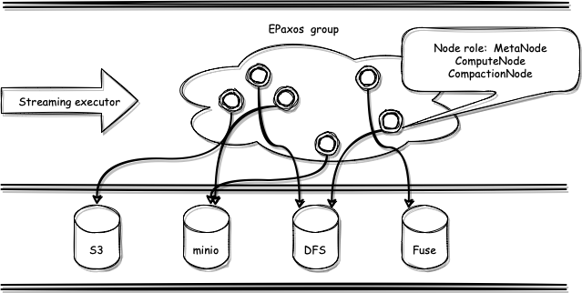
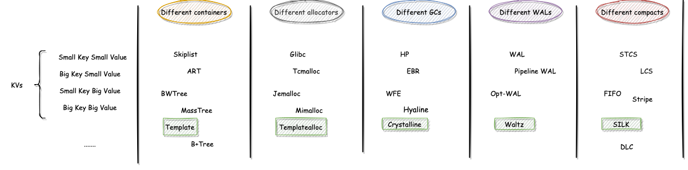
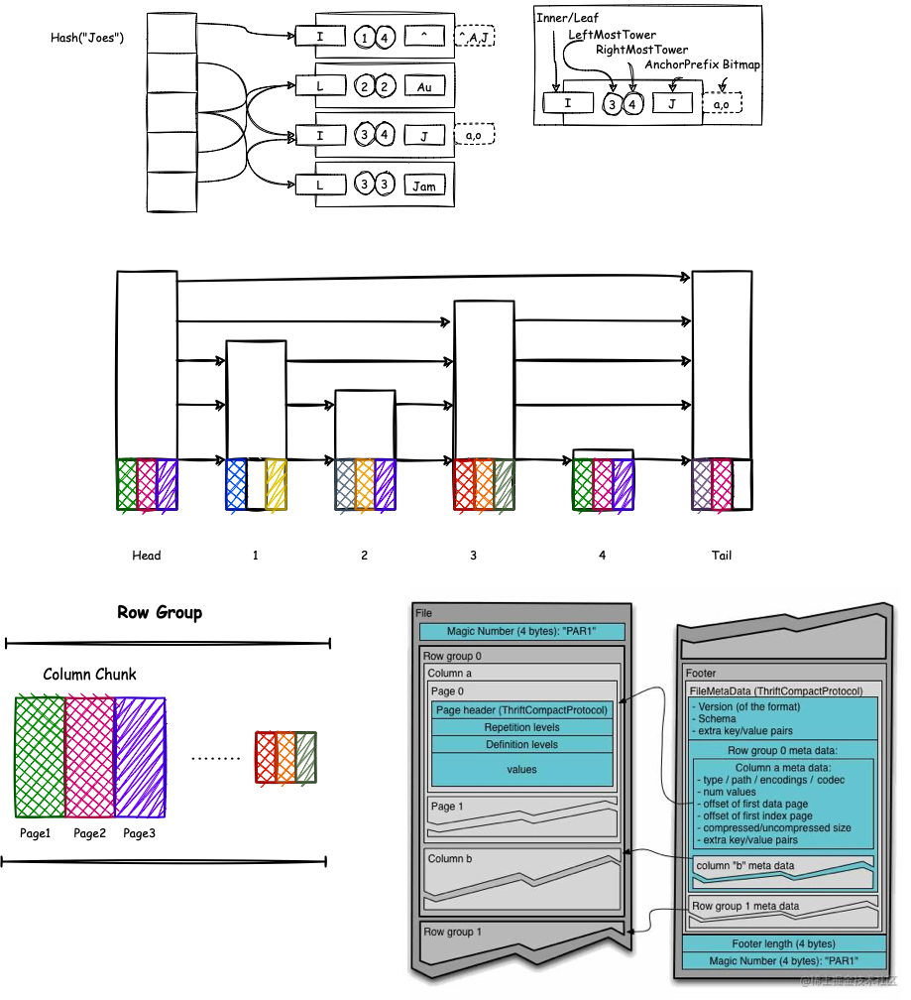

# TemplateKV

Template means template and is also the main language keyword for generalization in C++. The name template is meant to indicate that the purpose of this project is to provide a key-value system that can be specialized.

TemplateKV is a distributed key-value database that can be disassembled and assembled arbitrarily from observability and cloud-native perspectives. The abstraction can be combined and customized in any way in a heterogeneous distributed environment. Whether it is OLAP, OLTP, or even a temporal database and the streaming database behind, the appropriate underlying kv facilities can be obtained by assembling.

The design of TemplateKV is heavily inspired by various previous works, such as BigTable, Spanner, Percolator, and various new database papers in the last two years.


## Table of Contents

- [Background](#background)
- [Architecture](#Architecture)
- [Design](#Design)
- [Quick Start](#Quick Start)
- [Maintainers](#maintainers)
- [Contributing](#contributing)
- [License](#license)

## Background

​		Classic Key Value system such as RocksDB, LevelDB, etc. are for single node storage system, and need to build additional distributed formula protocol to write co-coherent data read and write, multi-threaded read and write mixed scenarios on memtable mutually exclusive access leads to performance degradation, due to the design of level-0 layer to create city key overlap, especially in When reading files need to find the level-0 layer, resulting in read amplification, especially when the pure random read, the extreme case will scan the entire level-0 layer, and the most headache is the compaction mechanism is not fully controlled, may not cause write amplification when writing the key, but also may cause more than ten times dozens of times after writing a key write amplification, and, to There are solutions to many of these problems in the community, but the introduction of a certain solution has brought about compromises in many other solutions.

​		In distributed storage, mainly etc., etc., almost all use draft/multi-raft/multi-paxos as the main distributed consensus protocol to coordinate data consistency in the cluster. Epaxos as leaderless design was published as early as 2012, but it is not widely used until now. The reason is that the current implementation and optimization of draft can cope with most scenarios in the industry environment, and it does not become the core of the problem itself, and also because the difficulty of draft protocol implementation is much lower, which leads to most systems in the industry is implemented by draft. But this situation may be changed in the coming time, because with the expansion of nodes and network throughput requirements, the use of leaderless distributed consensus protocols will become one of the next distributed storage field wind direction. And epaxos itself also has many problems, such as instances of seq de-duplication, failover scenarios to ensure the sequential nature of the log sequence, interface behavior needs to be redesigned to adapt to the current stage of the software stack, degraded to classic paxos in extreme scenarios with many conflicts, conflicting commands are resolved at the replication layer, affecting the upper layer concurrency Control and many other issues also need to cooperate with the specific implementation of the industry to ensure the accuracy and stability of the protocol.

​		Index structures or query data structures used to be dominated by B+tree, Skiplist, and Red-Black Tree. Take MySQL and Redis and RocksDB for example, their indexes and storage structures are based on B+Tree and Skiplist as the main data structures, while many people are familiar with other index lookup structures: arrays, chains, binary trees, hash tables, binary search trees, balanced search binary trees, red-black trees, I am only here from the perspective of data structures to shallow analysis here Why not, first of all, for arrays, chained tables such as linear tables, suitable for storing data, not finding data, similarly, for ordinary binary trees, there is no specific rule for data storage, so it is not suitable, and Hash indexes are usually ** random memory access, not cache friendly **, binary search tree tree type depends on the order of data input, in extreme cases will degenerate into chain tables, balanced search binary trees are too strict balance requirements, resulting in almost every insertion and deletion of nodes will destroy the balance of the tree, making the tree performance greatly reduced, ** red-black trees are too deep, data retrieval caused by frequent disk IO, andB-Tree and red-black trees are not friendly to sequential queries , so the use of B+tree is called out. The same is true for RocksDB which uses LSM structure, RocksDB needs accelerated writes -> sequential writes, needs to eventually drop the disk and needs efficient queries in ordered Blocks, so here it is better to use memory friendlier Skiplist, but there are `two ultimate problems`.

`Why do Mysql indexes use B+ trees instead of Skiplist?`

> B+ tree is a multinomial tree structure, each node is a 16k data page, which can store more index information, so the fan-out is very high. You can store about 2kw of data in about three levels. In other words, if the data pages are in the disk, it takes at most three times to query the disk IO. jump table is a chain table structure, a data a node, if the bottom layer to store 2kw data, and each query to be able to achieve the effect of dichotomous lookup, 2kw is about 24 times in 2, so the jump table is about 24 layers high. In the worst case, the 24 levels of data will be scattered in different data pages, that is, a query will experience 24 times of disk IO.
>
> So for storing the same amount of data, the height of the B+ tree is less than that of the jump table, which, if put on a mysql database, means fewer disk IOs and therefore faster B+ tree queries. For write operations, the B+ tree requires splitting and merging indexed data pages, while the jump table is inserted independently and the number of levels is determined based on a random function, without the overhead of rotating and maintaining balance, so the write performance of the jump table will be better than the B+ tree.

`Why does RocksDB/Redis use Skiplist instead of B+ trees or binary trees?`

> redis is a pure memory database, and rocksdb first write is also in the memory of the memtable, read and write data are operating memory, and disk, so there is no disk IO, so the layer height is no longer the disadvantage of jump table. And as mentioned earlier, the B+ tree is a series of merging and splitting operations, replaced by red-black trees or other AVL trees are also a variety of rotation, the purpose is also to maintain the balance of the tree. When inserting data into the jump table, you only need to randomize it and know whether you want to add indexes upwards, so you don't have to consider the nodes before and after, and there is less overhead of rotating the balance. Therefore, the jump table is chosen here instead of the B+ tree.
>
> > rocksDB uses jump tables internally, and compared to innodb with B+ trees, the write performance is better, but the read performance is really worse. In the scenario of more reads and fewer writes, the B+ tree still looks the same.

​		However, with the development of concurrency technology, concurrent data structures such as MassTree, ART, BwTree, PSL and other evolved data structures have gradually become familiar. However, due to their high implementation difficulty and the fact that the existing systems can meet the needs with optimized traditional data structures, such elegant and complex advanced data structures have remained in academic papers and few of them are used in real systems. In recent years, concurrent programming has become popular, and the concept of lock-free &&wait-free has been adopted by many systems, but many systems do not use this data structure as the underlying data to use, on the one hand, this data structure in the upper layer of the application less, on the other hand, it also shows that the current industry on the use of lock-free or not, there is still a considerable controversy. The use of lock-free data structures as the underlying data on the one hand indicates that there are few applications in the upper layer, and on the other hand indicates that there is still some controversy in the industry about whether to use lock-free or not.

​		Moreover, with the development of data processing, the real-time processing of time series data is gradually intersecting with OLAP and OLTP, and the boundaries are gradually becoming blurred. The rise of streaming databases in the past two years has heralded the gradual decentralization of streaming data processing to databases, and has put forward higher requirements for database development, deployment, and operation and maintenance. And in this context, this project designs a KV storage engine that adapts to streaming data, takes leaderless distributed consensus algorithm and redesigned memory data structure as the core, designs a building block style combination underlying architecture with the goal of pluggable and arbitrary combination, and takes into account the background of RDMA, DPDK, SPDK, as well as non-volatile storage and epbf, splits the Storage and Network layers are split to make more efficient use of the bypass kernel's capabilities.

​		Finally this project, with the purpose of teaching and learning, will incorporate many designs from the top sessions in recent years, in addition to the classical algorithms, in order to try to advance the development of the database field, and to be able to try to fill the gap between academic and industrial design, and to show more possibilities for many partners who love the underlying computer development like me.

## Architecture

The main architecture is shown below:



In a nutshell, encapsulate streaming data and commands into streaming executor to be streamed through epaxos state machine and finally applied to (possibly) different (remote) storage media. The streaming KV storage engine should also have the following capabilities.

- Each streaning executor can read the data of its own node as well as other nodes.
- metadata, log and other meta-information sharing of data nodes.
- snapshot reads for their own node's data are equal to the current read, and reading another node requires waiting for epoch.
- For streaming data support chaotic submission, but the order of execute and finally apply is judged according to specific commands and dependencies.

Each node is an ordinary member of the epaxos consensus group and has multiple identities, MetaNode, ComputeNode, and CompactionNode.

- MetaNode: each node undertakes the synchronization and sharing of metadata, whether querying or writing, whether using any of the nodes in the group, to find whether the data is stored in itself or others, locally or remotely.
- ComputeNode: Born to compute near the bottom, each node is also a computational unit, and also pushes the computation to other nodes in the group, "stealing" the computational power of other nodes.
- CompactionNode: Compaction instructions from their own or other nodes Meta messages (over a certain threshold or separate compact instructions), after completion to the nodes in the quorum/epoch to report the completion message.

> In order to support MVCC reads without affecting compression, the waterline will be tracked in epoch subsequently, either the latest, or the keyvalue will be kept if it is below the waterline.

## Design

### Building Block Strategy



According to the declaration cycle of a KV write, and different usage scenarios, this project provides a unified interface but different underlying implementations for reference and selection or custom development. From memory data structure, allocator, memory recycling strategy, pre-write logging and merge strategy, classical and newer implementations and plays are provided in advance respectively. And where green is the new attempt of this project using the relatively new papers and some of the author's ideas, for reference only, where.

- Template: for KV storage, its lock-free data structure developed on the basis of ShardMap, Trie, and Skiplist.
- Templatealloc: a memory allocator developed for storage systems and index data to improve memory utilization, and later consider adding an allocation scheduling strategy.
- Crystalline: a Wait-free memory recycling strategy incorporating HP+EBR.
- Waltz: distributed WAL.
- SILK: a new Compaction strategy incorporating IO scheduling.

### Index



One of the core of this project is shown above, its one of the core design of this project, the user writes kv, using Map structure to find which specific Trie node belongs to.

1. leaf node: drop directly into the Tower in Skiplist for judgment, get the corresponding Column Chunk, and then perform a dichotomous lookup for the Column Chunk.
2. non-leaf node: use some of the Towers in Skiplist to partially dichotomize the Key, and find the corresponding appropriate Tower for insertion operation, where
   1. the process of inserting a page is equivalent to the insertion of native skiplist, except that the key is compressed, multiple keys with the same prefix are put into the same page, and those with the same secondary prefix are put into the same Chunk.
   2. Chunk expansion will be split, directly merge the extra page pages into other Tower nodes can be.
3. write the final will become a Parquet structure, multiple Page combination for a Column Chunk (Tower), multiple Chunk divided into a Row Group (Partition);
4. Targeted optimization.
   1. using SIMD acceleration, which is friendly to the column storage structure.
   2. tying kernels for different Partitions to improve cache line hits.
   3. using locking for ShardMap+Trie and a lock-free structure for the underlying Skiplist.


### Allocators

TODO


### Memory Reclamation

TODO


### WAL

TODO


### Compaction

TODO

## Quick Start

**Compile from Source with Linux and macOS)**

```bash
# Install Rust toolchain
curl --proto '=https' --tlsv1.2 -sSf https://sh.rustup.rs | sh
# Clone the repo
git clone https://github.com/devillove084/TemplateKV.git && cd TemplateKV
# Compile
cargo build --release
# Test
cargo install nextest # (Optional)Use next test framework
cargo nextest test
```

## Maintainers

[@devillove084](https://github.com/devillove084)

## Contributing

Feel free to dive in! [Open an issue](https://github.com/devillove084/TemplateKV/issues/new) or submit PRs.

Standard Readme follows the [Contributor Covenant](http://contributor-covenant.org/version/1/3/0/) Code of Conduct.


## License

[MIT](LICENSE) © Richard Littauer
